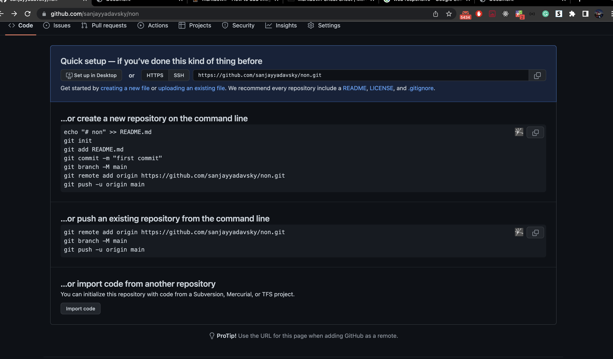
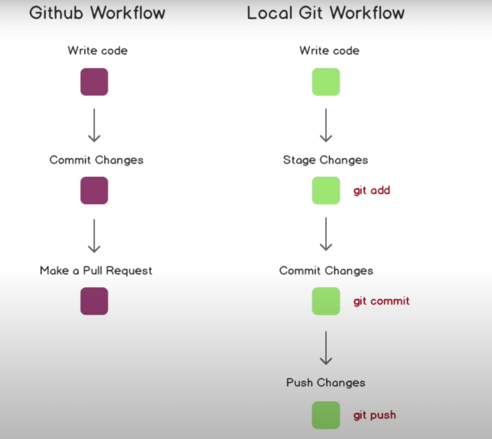

# **Cheet Sheet** on Git and GitHub 
## **how to formate Readme file** 
  **1.**  What is Markdown 

Markdown is a simple markup language that uses plain text formatting syntax and it is usually used for giving general ideas about programs as it is an easy-to-read, easy-to-write plain text format.

#### Some common **Markdown**
    1. Heading 
         for heading we use # space and text for heading 
    Example 
     a. # H1 
     b. ## H2 
     c. ### H3 

    2.Bold

    Example 
     **bold text**

    3.Italic
    Example
    *italicized text*

    4.Blockquote
    Example
    > blockquote

    5.Ordered List
    Example
       	1. First item
        2. Second item
        3. Third item

    6.Unordered List
     Example 
     - First item
     - Second item
     - Third item   

     7.Code (when we have to include some code)
     example 
     `code`
        `
        function myFunction() {
        document.getElementById("demo").innerHTML = numbers.some(checkValue);
        }`
 `
        function myFunction() {
        document.getElementById("demo").innerHTML = numbers.some(checkValue);
        }`    

    8. Or another way including code 
    ```nameOfTheLanguage
    code```
    Example
        ``` javascript
    function myFunction() {
    document.getElementById("demo").innerHTML = numbers.some(checkValue);
    }
    ```

    example of javascript language adding in readme file 
``` javascript
function myFunction() {
  document.getElementById("demo").innerHTML = numbers.some(checkValue);
}
```
    9.Horizontal Rule
    Example 
    ---

    10. Link 
    example 
    [title](https://www.example.com)

    11.Image (local)
    example 
    
    
    12. table
    | Syntax | Description |
    | -------| ----------- |
    | Header | Title |
    | Paragraph | Text |


---
# ****Git command****

## create a new repository on the command line

create git Repositories in a GitHub by clicking on the  icon **Repositories** then new icon then giving all the required information on file will be created with the below interface.



A. ` git init ` to initialize the Repositories.

B. `git add fileName`  git add than file name. (`git add ` to add the modified file )

C. `git add .` to add all the file.

D. `git commit -m "first commit" ` git commit is used to set message for the modification 

E. `git branch -M main` to update code in a speacific branch 

F. `git remote add origin https://github.com/sanjayyadavsky/no.git`  link specifice where the cde will ve stored 

G. `git push -u origin main` to finally update 

## ..or push an existing repository from the command line

`git remote add origin https://github.com/sanjayyadavsky/no.git`

`git branch -M main`

`git push -u origin main`

---



    